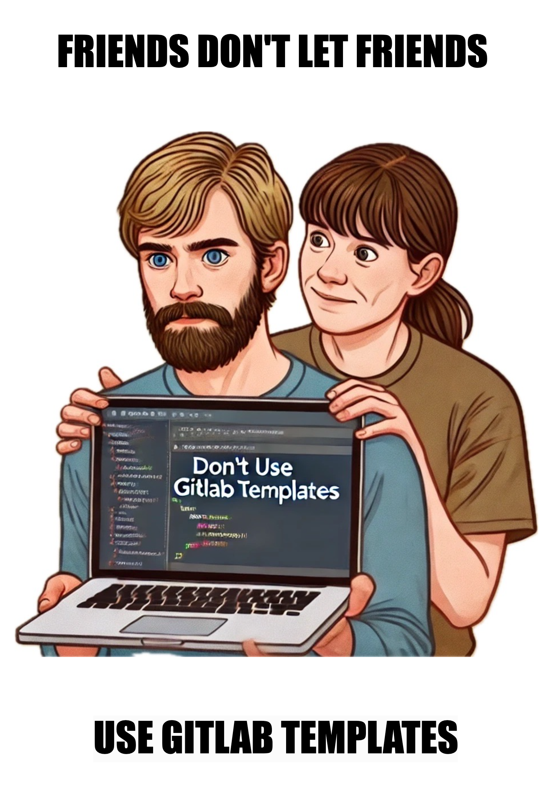

# Don't repeat yourself by using GitLab Components

Veröffentlicht am 22. Oktober 2024 von Sina und Patrick / Lesezeit: 10 Minuten / HandsOn: 2 Stunden

In this article we give a short introduction into the different GitLab Components and Templates and compare them with each other. Afterwards we give examples how wo implement them into the GitLab pipeline code.

Don't Repeat Yourself! When working with GitLab pipelines, one of the core principles to ensure efficiency and maintainability is "Don't Repeat Yourself" (DRY). Repetitive code not only increases maintenance overhead but also introduces the risk of inconsistencies across different parts of a project. GitLab's move from CI/CD templates to CI/CD components is a perfect example of applying DRY principles.

Once upon a time - GitLab Templates: GitLab CI/CD templates are predefined YAML files that provide reusable and shareable configurations for setting up CI/CD pipelines in GitLab. These templates were designed to simplify the process of defining pipelines by offering pre-configured stages, jobs, and scripts for common tasks, eliminating the need to write everything from scratch.

But the templates also bring some disadvantages:
* complexities of contributing new CI/CD templates
* no modularity within the templates

With the introduction of To Be Continuous (TBC) GitLab CI was made easy. It enables developers to build pipelines within minutes. The goal is to build a professional CI/CD pipeline as easy as possible by including a couple of GitLab CI templates in the .gitlab-ci.yaml file. The TBC templates are developed and maintained bei DevOps and technology experts to build state-of-the-art CI/CD pipelines. When following the guide and including the templates there is no need to master GitLab CI.

## 2024: USE GITLAB COMPONENTS
CI/CD components are the next generation of CI/CD templates. CI/CD components are reusable, single-purpose building blocks that abstract away pipeline configuration units. With the introduction of the CI/CD Catalog, GitLab is no longer accepting contributions of new CI/CD templates to the codebase. Instead CI/CD components for the catalog should be created. This transition enhances the modularity and maintainability of shared CI/CD resources, and avoids the complexities of contributing new CI/CD templates.

CI/CD components are similar to the other kinds of configuration added with the include keyword, but have several advantages:
* Components can be listed in the CI/CD Catalog.
* Components can be released and used with a specific version.
* Multiple components can be defined in the same project and versioned together.
* This leads to:
  * Reusability and abstraction
  * Flexibility with input
  * High-quality standards through testing




## COMPONENTS VS. TEMPLATE

In the following table Components (custom, GitLab and To Be Continous (TBC)) and Templates are compared.

|     | Components (custom)         | Components (GitLab) | Components (TBC)          | Templates |
| --- | -------------------------- | ------------------ | ------------ | -------- |
| **Description**     | Include custom files from another private project on the same GitLab instance to the pipeline| Add a modular [GitLab CI/CD component](https://docs.gitlab.com/ee/ci/components/index.html) to the pipeline | Set of GitLab CI templates developed and maintained by DevOps and technology experts to build state-of-the-art CI/CD pipelines in minutes | Predefined YAML files that provide reusable and shareable configurations for setting up CI/CD pipelines|
| **Include Keyword** | ```include:project``` or ```include:file``` | ```include:component``` | ```include:component``` to use it as a CI/CD component; ```include:project``` to use it as a regular template | ```include:template``` |
| **Source**          | custom project or file path | [GitLab Components](https://gitlab.com/components) or [Codehub Components](https://codehub.sva.de/components/) | [TBC Generator](https://to-be-continuous.gitlab.io/kicker/) or [TBC Repo](https://codehub.sva.de/to-be-continuous) | [CI-Templates](https://gitlab.com/gitlab-org/gitlab/-/tree/master/lib/gitlab/ci/templates) |
| **Configuration**   | [inputs](https://docs.gitlab.com/ee/ci/components/index.html#use-a-component) | [inputs](https://docs.gitlab.com/ee/ci/components/index.html#use-a-component) | with [inputs](https://docs.gitlab.com/ee/ci/components/index.html#use-a-component) if using the include:component technique or with [variables](https://docs.gitlab.com/ee/ci/variables/) if using include:project or include:remote | [variables](https://docs.gitlab.com/ee/ci/variables/)                                                                                                                                                                                                                                    |


## REUSE A (CUSTOM) PIPELINE COMPONENT

* Custom components can be created when there is no published component in the CI/CD Catalog (that has the functionality your project needs)
* The component files have to be stored in a project on the same GitLab instance

### PIPELINE COMPONENT DEFINITION 

In this example a custom build-ko component is created in the "components" folder. That can be included later in .gitlab-ci.yml file. 

```yaml
# sharedpipelines-repository(Lab/stuttgart-things/stuttgart-things):components/build-ko-image.yaml

spec:
  inputs:
    stage:
      default: build
---
ko-build:
  image: ghcr.io/ko-build/ko:df484d2df9da64a3fa89f2cb3b6286b21be04dac
  stage: $[[ inputs.stage ]]
  before_script:
    - export KO_DOCKER_REPO=$KO_DOCKER_REPO
  script:
    - ko login $REGISTRY -u $REGISTRY_USER -p $REGISTRY_PASSWORD
    - ko build $KO_REPO --insecure-registry
  tags:
    - sthings
```

* add a git tag to create a proper reference to the pipeline (better than using "latest greatest" main/master as ref)

### COMPONENT CALL
This example shows how to include the build-ko component that was created above in the .gitlab-ci-yml file.

```yaml
# your-app-repository: .gitlab-ci.yml

include:
  - project: Lab/stuttgart-things/stuttgart-things
    file: components/build-ko-image.yaml
    ref: kobuild-go-123-2
```


### example - include the component located in the current project from the current SHA

```yaml
# .gitlab-ci.yml

include:
  - component: $CI_SERVER_FQDN/$CI_PROJECT_PATH/my-component@$CI_COMMIT_SHA
    inputs:
      stage: build

stages: [build, test, release]
```


## USE GITLAB COMPONENT

The CI/CD Catalog contains published components that can be used if they have the functionality needed, so that no custom components have to be created.


### example - use the full go pipeline
The full go pipeline is included to the .gitlab-ci.yml file and the go image is given as input.
```yaml
# .gitlab-ci.yml

include:
  - component: codehub.sva.de/components/go/full-pipeline@97f5a6f4811246faa07892e75a17c4c9f7f9c2e3
    inputs:
      go_image: 'golang:1.23.2'

stages: [build]
```

### example - only use the build part of the go pipeline
In this example also the go components is included to the pipeline file but only the build part and not the full pipeline.
```yaml
# .gitlab-ci.yml

include:
  - component: codehub.sva.de/components/go/build@97f5a6f4811246faa07892e75a17c4c9f7f9c2e3
    inputs:
      go_image: 'golang:1.23.2'

stages: [build]
```

## USE TO BE CONTINUOUS 

TBC templates can be included in the .gitlab-ci.yml file using one of the three techniques:

* include:component
* include:project
* include:remote

### Use as a CI/CD component

```yaml
# .gitlab-ci.yml

include:
  - component: codehub.sva.de/to-be-continuous/golang/gitlab-ci-golang@4.11.0
    inputs:
      image: "registry.hub.docker.com/library/golang:1.23.2"
```

### Use as a CI/CD template

```yaml
# .gitlab-ci.yml

include:
  - project: 'to-be-continuous/golang'
    ref: '4.11.0'
    file: '/templates/gitlab-ci-golang.yml'

variables:
  GO_IMAGE: "registry.hub.docker.com/library/golang:1.23.2"

```


## USE GITLAB TEMPLATES

GitLab templates can be included with the include:template technique as shown bellow. GitLab is no longer accepting contributions of new CI/CD templates to the codebase.

```yaml
# .gitlab-ci.yml

include:
  - template: Jobs/SAST.gitlab-ci.yml

variables:
  SCAN_KUBERNETES_MANIFESTS: "true"

```

## CONCLUSION

This article provides a comprehensive overview of GitLab CI/CD components and templates, highlighting their differences and use cases. The shift from templates to components aligns with the "Don't Repeat Yourself" (DRY) principle, reducing redundant code and enhancing maintainability. GitLab's introduction of components offers a more flexible and modular solution. These components allow developers to build efficient, reusable pipelines with minimal effort, promoting best practices in CI/CD development. 

