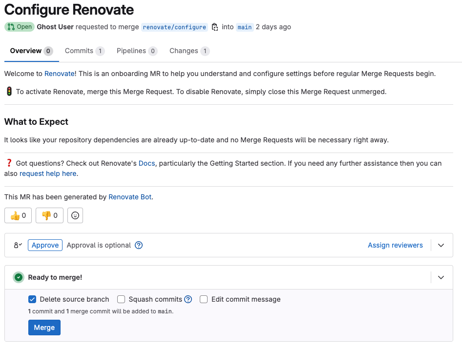
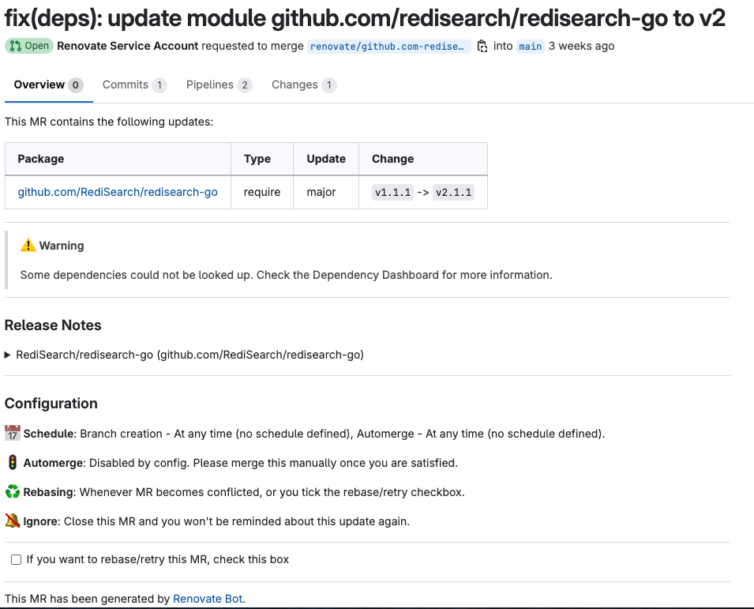

# Renovate w/ renovate

[//]: # (Abstract)
[//]: # (Links)
[//]: # (Intro)

## Introduction

Nowadays, an application quickly contains several dozen libraries, also known as dependencies. These regularly publish new versions, sometimes several times a week. 
Dependencies should be updated regularly in order to benefit promptly from the advantages of a new version. The older the dependencies are, the more time-consuming it is to update them to the latest version. This is because the changelog grows and the probability of breaking changes increases. Renovate is a tool that can take over the updating of dependencies. 

Renovate updates dependencies in the code without needing to do it manually. Renovate runs on the repo and looks for references to dependencies (both public and private). If there are newer versions available, Renovate can create pull requests to update versions automatically. Rennovate is a self-hosted tool that you run in your own CI/CD pipeline, works with GitHub, GitLab, and many more.

Why use Renovate?
Over trime dependencies become obsolete and insecure. Via a list of PRs Renovate creates transparency with regard to outdated dependencies. This makes dependencies plannable.

Renovate only generates PRs for obsolete direct dependencies, not for indirect / transitive dependencies. Overwriting transitive deps often technically difficult or impossible. And dependency update is the task of the respective maintainer. But there are dedicated tools for detecting unsafe dependencies: OSS Review Toolkit, Trivy, OSV Scanner,
Dependabot Alerts, etc.

### Initial Merge Request for configuring Renovate in the Repo:



### Example Merge Request for dependency created by Renovate:



### Post Upgrade Tasks

Renovate should perform further tasks when creating PRs (any shell commands possible), for example notification of the team via mail or execute linting.

An alternative to Post Upgrade Tasks are Post Update Options. That comes with 12 preconfigured actions (npm/yarn, go, Ruby bundler, Helm), e.g. “go mod tidy” or “helm dependency update”.

### RegEx Manager

Finding dependencies in “custom file formats” that are not supported by the supplied managers. For example shell scripts (curl ...), or RUN in a Dockerfile or GitHub Actions parameters or custom JSON/YAML file formats.

## Integrated Automated Dependency Updates

[//]: # (TABLE?)

* GoLang Dependencies
* Dockerfile
* Helm-Charts - Public
* OCI Dependencies [HELM](https://docs.renovatebot.com/modules/manager/helmv3)
* Flux Dependencies (Preview Envs?)
* ArgoCD Dependencies (Preview Envs?)

## RENOVATE vs. DEPANDABOT


### Table of features

In the table bellow some of the main feature of Renovate and Dependabot are compared:

| Feature                                   | Renovate                                                                                                                       | Dependabot                                                                                                                                                                   |
| ----------------------------------------- | ------------------------------------------------------------------------------------------------------------------------------ | ---------------------------------------------------------------------------------------------------------------------------------------------------------------------------- |
| Dependency Dashboard                      | Yes                                                                                                                            | No                                                                                                                                                                           |
| Officially supported platforms            | GitHub, GitLab, Bitbucket, Azure, Gitea                                       | GitHub only                                                                                                                                                                  |
| Show changelogs                           | Yes                                                                                                                            | Yes                                                                                                                                                                          |
| Built-in to GitHub                        | No, requires app or self-hosting                                                                                               | Yes                                                                                                                                                                          |
| Scheduling                                | By default, Renovate runs as often as it is allowed to | `daily`, `weekly`, `monthly`                                                                                                                                            |

                                                                    
Renovate offers a broader spectrum of functionality. Its package manager support, customization for complex project needs, and seamless integration with external vulnerability databases empower developers to implement a proactive security posture. Additionally, Renovate’s granular pull request control streamlines code review and collaboration.

When should one prefer renovate?
* Large projects with complex dependencies or monorepos.
* Cross-platform support requirements, or when using multiple package managers.
* Teams that want more control over scheduling, grouping, and merging of dependency updates.
* Organizations that need self-hosted options or more control over security and compliance.
* Teams that prefer advanced automation and detailed changelogs.

## RENOVATE DRY-RUN

```bash
cat <<EOF > config.json
{
    "repositories": ["stuttgart-things/clusterbook"],
    "dryRun" : "full"
}
EOF

docker run --rm -v "$(pwd)/config.json:/opt/renovate/config.json"`\
-e RENOVATE_PLATFORM=github \
-e RENOVATE_TOKEN=${GITHUB_TOKEN} \
-e LOG_LEVEL=debug \
-e RENOVATE_CONFIG_FILE=/opt/renovate/config.json \
renovate/renovate
```

https://github.com/renovatebot/renovate/blob/main/docs/usage/examples/self-hosting.md

## SETUP RENOVATE

1. Add Renovate to Your Repository
First, enable Renovate for your repository. If you're using GitHub, GitLab, or Bitbucket, this usually involves adding the Renovate app to your repository through the platform’s marketplace or Renovate’s official website.

2. Create a renovate.json configuration file in the root of your repository to tell Renovate how to handle updates. Here’s a basic setup for a Docker-based project:

```json
{
  "extends": [
    "config:base"
  ],
  "dockerfile": {
    "fileMatch": ["Dockerfile", "Dockerfile.*"],
    "enabled": true
  },
  "packageRules": [
    {
      "managers": ["dockerfile"],
      "matchDatasources": ["docker"],
      "groupName": "docker dependencies"
    }
  ]
}
```

3. Run Renovate Locally (Optional)

```bash
docker run --rm -v "$(pwd):/usr/src/app" renovate/renovate
```


## Custom Dependency Updates

[//]: # (Add sthings ansible example)

```bash
cat <<EOF > renovate.json
{
    "$schema": "https://docs.renovatebot.com/renovate-schema.json",
    "extends": [
        "config:recommended"
    ],
    "customManagers": [
        {
            "customType": "regex",
            "fileMatch": [
                "\\.yaml$"
            ],
            "matchStrings": [
                "\\s*(?<binName>.+)_version:\\s(?<currentValue>v?\\d+\\.\\d+\\.\\d+)\\s*#\\s*(datasource=(?<datasource>[^\\s]*))\\s*(depName=(?<depName>[^\\s]*))?\\s*"
            ],
            "versioningTemplate": "{{#if versioning}}{{{versioning}}}{{else}}semver{{/if}}",
            "extractVersionTemplate": "^v?(?<version>.*)$",
            "datasourceTemplate": "{{#if datasource}}{{{datasource}}}{{else}}github-releases{{/if}}",
            "depNameTemplate": "{{#if depName}}{{{depName}}}{{else}}{{{binName}}}{{/if}}"
        },
        {
            "customType": "regex",
            "fileMatch": ["^Dockerfile$"],
            "matchStrings": [
                "\\s*(?<binName>.+)_version:\\s(?<currentValue>v?\\d+\\.\\d+\\.\\d+)\\s*#\\s*(datasource=(?<datasource>[^\\s]*))\\s*(depName=(?<depName>[^\\s]*))?\\s*"
            ],
            "versioningTemplate": "{{#if versioning}}{{{versioning}}}{{else}}semver{{/if}}",
            "extractVersionTemplate": "^v?(?<version>.*)$",
            "datasourceTemplate": "{{#if datasource}}{{{datasource}}}{{else}}github-releases{{/if}}",
            "depNameTemplate": "{{#if depName}}{{{depName}}}{{else}}{{{binName}}}{{/if}}"
      }
    ],
    "customDatasources": {
      "hashicorp": {
        "defaultRegistryUrlTemplate": "https://api.releases.hashicorp.com/v1/releases/{{packageName}}?license_class=oss",
        "transformTemplates": [
          "{ \"releases\": $map($, function($v) { { \"version\": $v.version, \"releaseTimestamp\": $v.timestamp_created, \"changelogUrl\": $v.url_changelog, \"sourceUrl\": $v.url_source_repository } }), \"homepage\": $[0].url_project_website, \"sourceUrl\": $[0].url_source_repository }"
        ]
      }
    }
}
EOF
```

```
vars:
  - name: tools
    file: |
      ---
      kind_version: 0.25.0 # datasource=github-tags depName=kubernetes-sigs/kind
      skopeo_version: 1.14.4 # datasource=github-tags depName=lework/skopeo-binary
      helm_version: 3.16.2 # datasource=github-tags depName=helm/helm
      kubectl_version: v1.30.2 # datasource=github-tags depName=kubernetes/kubectl
      k9s_version: v0.32.5 # datasource=github-tags depName=kubernetes/kubectl
      velero_version: 1.15.0 # datasource=github-tags depName=vmware-tanzu/velero
      kubectl_slice_version: 1.4.0 # datasource=github-tags depName=patrickdappollonio/kubectl-slice
      helmfile_version: 0.169.1 # datasource=github-tags depName=helmfile/helmfile
      argocd_version: 2.13.0 # datasource=github-tags depName=argoproj/argo-cd
      flux_version: 2.4.0 # datasource=github-tags depName=fluxcd/flux2
      glab_version: 1.48.0 # datasource=gitlab-tags depName=gitlab-org/cli
      cilium_version: 0.16.19 # datasource=gitlab-tags depName=cilium/cilium-cli
      dagger_version: 0.13.3 # datasource=gitlab-tags depName=dagger/dagger

      bin:
        flux:
          bin_name: flux
          bin_version: "{{ flux_version }}"
          check_bin_version_before_installing: true
          source_url: "https://github.com/fluxcd/flux2/releases/download/v{{ flux_version }}/flux_{{ flux_version }}_linux_amd64.tar.gz"
          bin_to_copy: flux
          to_remove: ""
          bin_dir: "/usr/bin/flux"
          version_cmd: "version"
          target_version: "{{ flux_version }}"
```

## GitHub Integration


## GitLab Integration

There are various ways in which Renovate can access a repository or several repositories. If Renovate should only run in one repository, a GitLab access token with api and write_repository access is sufficient. If Renovate is to take care of several repositories, it is advisable to create a Renovate user in GitLab and add this user as a member (maintainer or developer) to the relevant projects.

### GitLab.com

```json
# config.json

{
    "platform": "gitlab",
    "endpoint": "https://gitlab.com/api/v4",
    "token": "<TOKEN>",
    "repositories": ["<YOUR_GITLAB_REPOSITORY>"] ,
    "dryRun": "false"
  }
```

Run Renovate

```bash
docker run --rm -e RENOVATE_CONFIG_FILE=config.json -v "$(pwd)/config.json:/usr/src/app/config.json" renovate/renovate
```

Renovate will create an Issue called "Dependency Dashboard" in GitLab with the findings.

### self-hosted GitLab

```json
# config.json

{
    "platform": "gitlab",
    "endpoint": "https://companyhub.de/api/v4",
    "token": "<TOKEN>",
    "repositories": ["<YOUR_REPOSITORY>"] ,
    "dryRun": "full"
  }
```

Run Renovate

```bash
docker run --rm -e RENOVATE_CONFIG_FILE=config.json -v "$(pwd)/config.json:/usr/src/app/config.json" renovate/renovate
```

Renovate will create an Issue called "Dependency Dashboard" in GitLab with the findings.


## Local / Testing

```json
# config.json
{
    "platform": "gitlab",
    "endpoint": "https://companyhub.sva.de/api/v4",
    "token": ${GITLAB_TOKEN},
    "repositories": ["<YOUR_REPOSITORY>"] ,
    "dryRun": true
  }
```

Run Renovate Locally

```bash
docker run --rm -e RENOVATE_CONFIG_FILE=config.json -e LOG_LEVEL=debug -v "$(pwd)/config.json:/usr/src/app/config.json" renovate/renovate
```
## CompanyHub Configuration

Renovate Runner Onboarding:
* add Renovate Service Account to repo or group
* wait for next pipeline schedule to get onboarding pr
* accept the onboarding pr in the repos
* wait for next pipeline schedule to get dep prs

  
## Renovate in CI/CD Pipeline (GitLab)

```yaml
#.gitlab-ci.yml

stages:
  - dependency_updates

renovate:
  image: renovate/renovate:slim
  stage: dependency_updates
  variables:
    RENOVATE_PLATFORM: gitlab
    RENOVATE_ENDPOINT: $CI_API_V4_URL
    RENOVATE_AUTODISCOVER: "true"
    RENOVATE_BINARY_SOURCE: install
    LOG_LEVEL: debug
  tags:
    - docker
  only:
    - schedules
  script:
    - renovate $RENOVATE_EXTRA_FLAGS
```

RENOVATE_AUTODISCOVER: This flag specifies that Renovate should automatically search all repositories to which it has access for dependencies.

RENOVATE_BINARY_SOURCE: Renovate uses this to install third-party tools that it needs to be able to perform updates, e.g. npm, yarn, ...

## Conclusion

Renovate can be used quickly with little configuration to regularly update dependencies. It helps to keep the application up to date at all times. This contributes to the error-free and reliable operation of the application.

[//]: # (outro)
